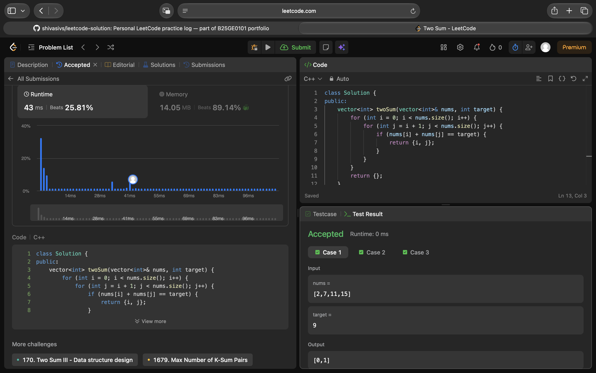

## Problem: Two Sum (Easy)

**Link:** https://leetcode.com/problems/two-sum/

### Approach

Track each previously seen number and index in a hash map. For each number, check whether its complement was seen; this gives a one-pass solution.

### Complexity

- Time: O(n)
- Space: O(n)

### Notes

The problem guarantees one answer. Check the complement before saving the current value so the same array element is not used twice.

### Local tests

Compile and run the in-file assertions from the repository root with:

```sh
g++ -std=c++17 -DLOCAL_TEST arrays-strings/001-two-sum.cpp -o /tmp/leetcode-local-test && /tmp/leetcode-local-test
```

### LeetCode result evidence

The genuine Accepted result screenshot preserved from the existing repository is included here.



Result: **Accepted**.
