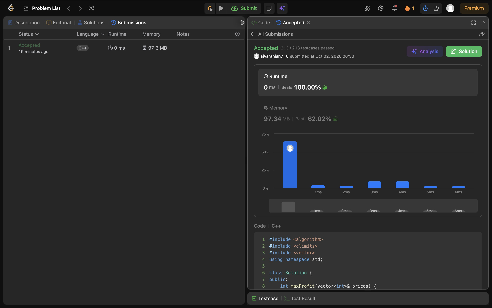

## Problem: Best Time to Buy and Sell Stock (Easy-Medium)

**Link:** https://leetcode.com/problems/best-time-to-buy-and-sell-stock/

### Approach

Keep the lowest price seen so far and the best profit possible. At each price, calculate the profit from buying at that minimum.

### Complexity

- Time: O(n)
- Space: O(1)

### Notes

The buy must happen before the sell. Decreasing prices should return zero.

### Local tests

Compile and run the in-file assertions from the repository root with:

```sh
g++ -std=c++17 -DLOCAL_TEST arrays-strings/004-best-time-to-buy-and-sell-stock.cpp -o /tmp/leetcode-local-test && /tmp/leetcode-local-test
```

### LeetCode result evidence

The real submission is **Accepted**: [LeetCode submission](https://leetcode.com/problems/best-time-to-buy-and-sell-stock/submissions/2159552406/). The genuine full-screen Chrome result screenshot is included below.


