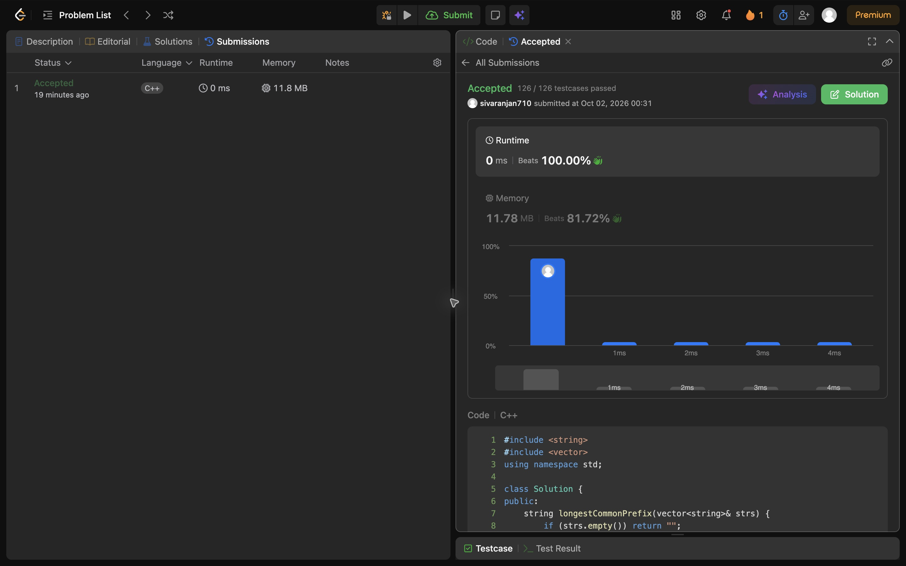

## Problem: Longest Common Prefix (Easy-Medium)

**Link:** https://leetcode.com/problems/longest-common-prefix/

### Approach

Start with the first word as the candidate prefix. Shorten it until every other word starts with it; return the remaining prefix.

### Complexity

- Time: O(S)
- Space: O(1) extra space

### Notes

S is the total number of characters inspected. An empty input list or any mismatch at the first character produces an empty prefix.

### Local tests

Compile and run the in-file assertions from the repository root with:

```sh
g++ -std=c++17 -DLOCAL_TEST arrays-strings/005-longest-common-prefix.cpp -o /tmp/leetcode-local-test && /tmp/leetcode-local-test
```

### LeetCode result evidence

The real submission is **Accepted**: [LeetCode submission](https://leetcode.com/problems/longest-common-prefix/submissions/2159553408/). The genuine full-screen Chrome result screenshot is included below.


