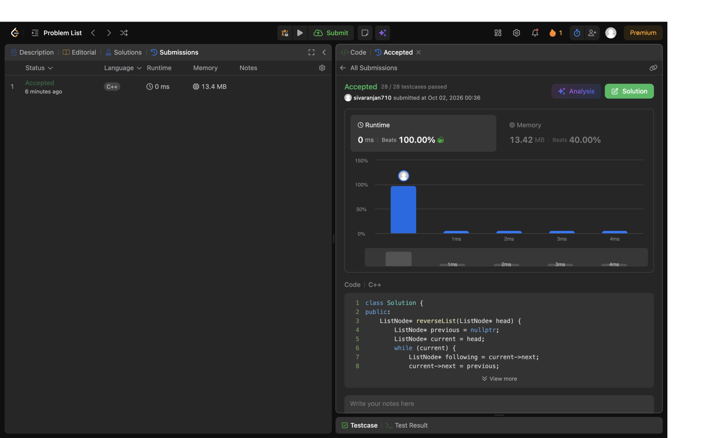

## Problem: Reverse Linked List (Bonus) (Bonus)

**Link:** https://leetcode.com/problems/reverse-linked-list/

### Approach

Walk the list with previous and current pointers. Save the next node, reverse the current link, and advance.

### Complexity

- Time: O(n)
- Space: O(1)

### Notes

The method handles an empty list and a one-node list. LeetCode supplies ListNode; the small class below also permits local checks.

### Local tests

Compile and run the in-file assertions from the repository root with:

```sh
g++ -std=c++17 -DLOCAL_TEST linked-lists/bonus-009-reverse-linked-list.cpp -o /tmp/leetcode-local-test && /tmp/leetcode-local-test
```

### LeetCode result evidence

The real bonus submission is **Accepted**: [LeetCode submission](https://leetcode.com/problems/reverse-linked-list/submissions/2159556897/). The genuine full-screen Chrome result screenshot is included below.


